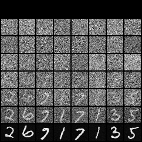

# Difussion-Generative-Models-Mnist

### 資料集

+ MNIST 60000 手寫 0~9數字，大小為 28x28 的圖片，並且是 RGB 的呈現方式。

### 資料前處理

```python
transform = transforms.Compose([
    transforms.Grayscale(num_output_channels=1),
    transforms.ToTensor(),
    transforms.Lambda(lambda x: (x - 0.5) * 2)
])
```

### 訓練內容

1. 主要使用 U-Net 模型架構進行訓練

2. 訓練完成後會儲存 model weight

3. 讀取 model  weight 後開始 generate image data，並儲存在 image 的目錄中

4. 最後使用 torch make_grid 產生 diffusion process image

5. 生成結果:

   

### 評估效果好壞

+ 利用 FID 驗證產生的圖片品質，越低表示和原圖越相近。

### 如何執行程式

1. 建立 train 目錄 (和 hw03_310581040.ipynb 在同個目錄下)，並且將 MNIST 的 training data 放進 train 目錄中 
1. hw03_310581040.ipynb 的檔案直接執行 code 即可。
